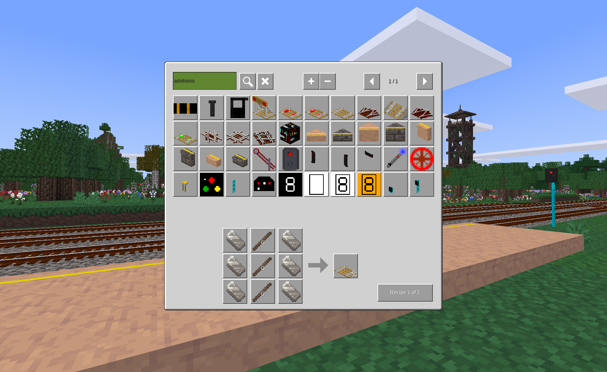

# AdvTrains Crafting Compatibility Patch

*DISCLAIMER: This is currently a Beta release intended for community evaluation and feedback.  Although it has been tested and functions as expected, be sure to make the necessary backups before using in established games.*

**AdvTrains Crafting Compatibility Patch** allows the the crafting of items such as tracks, signals, signs, etc. from the [AdvTrains](https://content.minetest.net/packages/orwell/advtrains/) mod while playing in survival mode of games that are not based on "Minetest Game".

***Note: This patch is typically not needed when using AdvTrains in "Minetest Game" or its variants.***

AdvTrains is not game specific and its items can always be acquired when playing in creative mode.  However, it is not always possible to craft its items when playing in survival mode in some games.  The reason for this is that AdvTrains registers its crafting recipes with the assumption that it is being used by "Minetest Game" or a game based on some of the mods from "Minetest Game".  This means that if AdvTrains is used in a game without the necessary mods, some or all of its crafting recipes may not be usable due to unavailable items.  In that case, the only way to get critical items such as track, tools, wagon parts, signs & signals and platforms when playing in survival mode would be to have the *creative* or *give* privilege or, if playing on a multi-player server, the admin provides the items via shops, chests, etc.  This mod adds the crafting recipes for items from AdvTrains to a select set of games that are not based on "Minetest Game" using suitable material substitutions from the respective game.  It currently adds crafting support for the following games:

- [Farlands Reloaded](https://content.minetest.net/packages/wsor4035/farlands_reloaded/)*
- [Hades Revisited](https://content.minetest.net/packages/Wuzzy/hades_revisited/)*
- [Minecloneia](https://content.minetest.net/packages/ryvnf/mineclonia/)
- [VoxeLibre](https://content.minetest.net/packages/Wuzzy/mineclone2/)

	*Some AdvTrains items related to Lua automation will remain uncraftable due to their dependency on [Digilines](https://content.luanti.org/packages/Jeija/digilines/) which does not currently support these games.

This mod will also optionally remove the AdvTrains crafting recipes that are based on ingredients from "Minetest Game" that are unavailable in the current game.  This should be safe in most cases.  However, if using another mod that provides alternate crafting recipes for the items from AdvTrains then this feature should be disabled via the mod settings since it might remove those alternate recipes.

Note that because this mod is a patch, it is susceptible to being broken by future changes to the crafting recipes in AdvTrains and material changes in the games that this mod attempts to support.

Finally, this mod also provides an API so that other mods can customize the material substitution mapping used in the crafting recipes created by this mod if desired.  See [API_reference_guide.md](API_reference_guide.md) for details.

## Licenses

Copyright © 2024-2025 Marnack

- AdvTrains Crafting Compatibility Patch is licensed under AGPL-3.0-or-later, see [LICENSE.txt](LICENSE.txt) for details.

### Attributions

- Portions of the crafting code were copied from [AdvTrains](https://git.bananach.space/advtrains.git/) (release-2.6.0) by orwell96 and contibutors which is licensed under AGPL-3.0-or-later.
